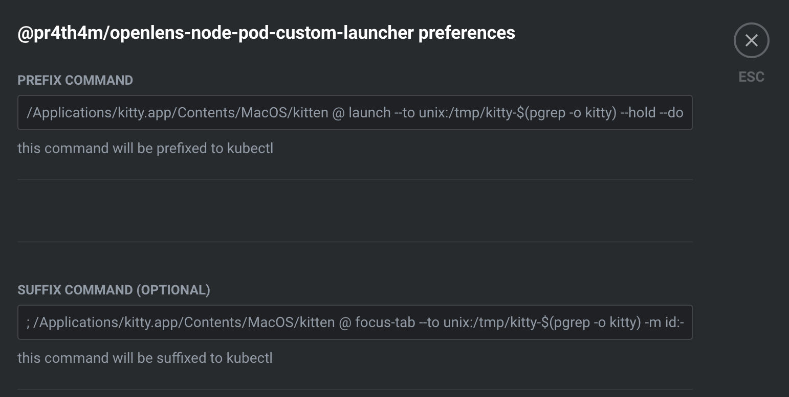
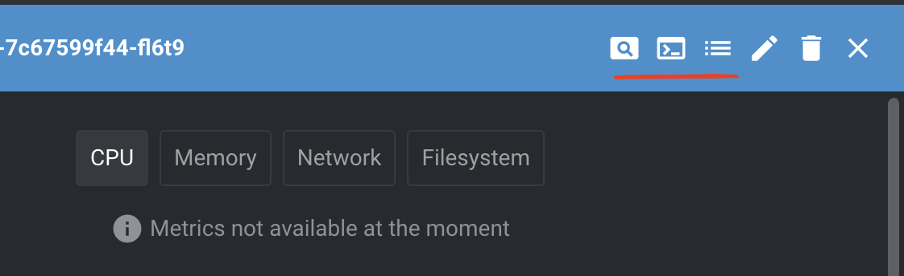

# Openlens node / pod custom launcher extension

This extension lets you define a custom terminal launcher to open pod/node shell, logs etc

## Features

- Ability to define custom launcher terminal as prefix and suffix to lens kubectl command 
- Open pod/node shell, pod logs, attach to pod from pod menu

## Prerequisite

- Switch to relevant context in kubectl
  ```bash
  kubectl config use-context <name>
  ```

## Usage

### Installation
In OpenLens, navigate to the Extensions. In the text box, enter the name of this plugin:
```
@pr4th4m/openlens-node-pod-custom-launcher
```
Click "Install", and after a few moments, the plugin should appear in the list of installed extensions and be enabled.

### Define custom launcher
In OpenLens, navigate to Settings > Extensions, click on this extension name 

There are two params available
- Prefix command - This command will prefix kubectl in lens
- Suffix command (optional) - This command will suffixed kubectl in lens

### Open with pod menu
In OpenLens, navigate to Clusters > Workloads > Pods, click on a pod

Clicking on the options highlighted will open pod shell, logs etc in the custom launcher terminal program you configured above

## Quick debugging
- In OpenLens, navigate to View > Toggle developer tools
- Complete command with prefix and suffix is logged
- Tweak prefix and suffix command in Settings/Preferences

## Development
- To develop plugin locally
  ```bash
  npm ci
  npm run build
  npm pack
  ```
- The tarball for the extension will be placed in the current directory. In OpenLens, navigate to the Extensions and provide the path to the tarball to be loaded, or drag and drop the extension tarball into the OpenLens window. After loading for a moment, the extension should appear in the list of enabled extensions.
- [More advanced option is to sym-link extension directory](https://github.com/lensapp/lens/blob/master/docs/extensions/get-started/your-first-extension.md)

## References
- https://github.com/lensapp/lens
- https://github.com/alebcay/openlens-node-pod-menu 

## TODO

- Add custom launcher terminal to nodes
- Add test cases
- Switch kubectl context before opening in pod menu
